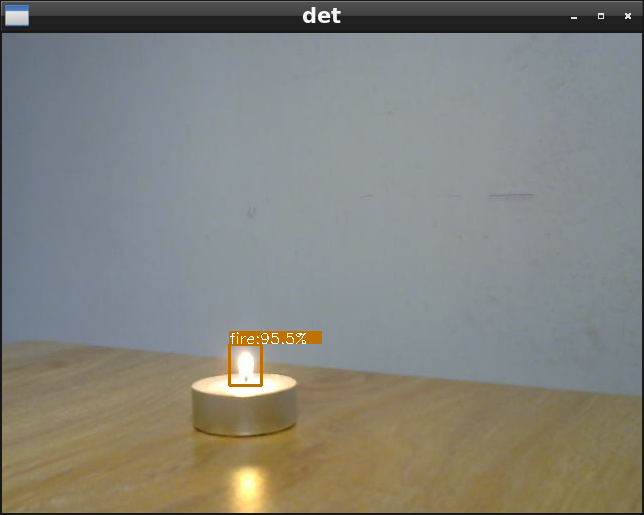

# Fire detection on Jetson Nano using NanoDet
This is a real-time inference implementation of fire detection on Nvidia Jetson Nano (2GB) developer kit using NannoDet.

## Dependices
Notice: The JetPack 4.4 production release [L4T R32.4.3] only supports PyTorch 1.6.0 or newer, due to updates in cuDNN.
```
Cython
termcolor
numpy
torch
torchvision
tensorboard
pycocotools
matplotlib
pyaml
opencv-python
tqdm
```
Recommend torch 1.6 + vision 0.7, if your have trouble with PyTorch installation on Jetson, see [Nvidia Developer Forums](https:///forums.developer.nvidia.com/t/pytorch-for-jetson-version-1-7-0-now-available/72048) for detail.
## Live cam inference
My camera model is Logitech C270 with default id 0, if it's not same with yours, modify camera id by hand in advance. 
```
$ ls /dev/video*
/dev/video0
```
After all the dependencies were built, connect your web cam to Jetson Nano and run:
```
python3 livecam.py
```
It may takes a while to initiate. Press Esc to quit the program.
## Train your own dataset
You can train your own dataset by place them in `fire/tarin` and `fire/val`, with labelImg tool, you can easily get annotation file in voc.
```
fire
├── train
│   ├── ann
│   │   ├── 1.xml
│   │   └── 2.xml
│   └── img
│       ├── 1.jpg
│       └── 2.jpg
└── val
    ├── ann
    │   └── 1.xml
    └── img
        └── 1.jpg
```
NanoDet supports dataset in both voc and coco format, you should generate your own config file before training your own dataset. 
```
save_dir: ./fire
num_classes: 1
class_names: &class_names ['fire']
train:
  name: xml_dataset
  img_path: ./fire/train/img
  ann_path: ./fire/train/ann
  input_szie: [320,320]
val:
  name: xml_dataset
  img_path: ./fire/val/img
  ann_path: ./fire/val/ann
  input_szie: [320,320]
```
Due to limited resources on Jetson Nano, it's recommended to train model on PC with powerful GPU and deploy inference on Jetson Nano.
```
python3 train.py [your_own_config.yml]
```
With the end of last epoch, you will get weight file in save_dir named `model_last.pth` by default. In my case, it takes about 2.5 hr to train 400 images on RTX2080 with batch_size = 80 and total_epochs = 160.
## Thanks
https://github.com/RangiLyu/nanodet  
https://courses.nvidia.com/courses/course-v1:DLI+S-RX-02+V2/about